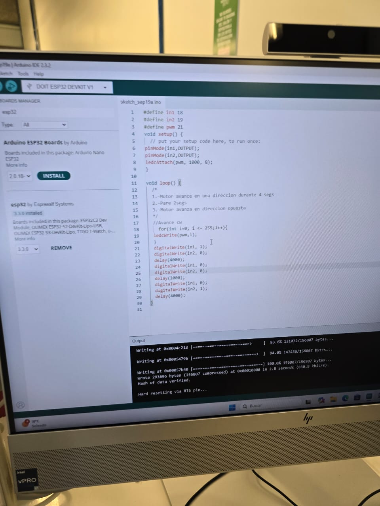
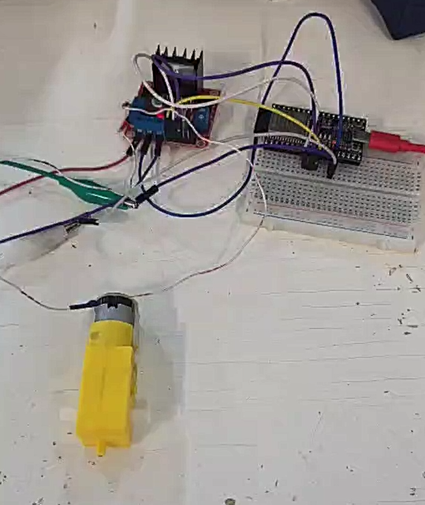

# Control de un motor DC con ESP32 y L298N

## Objetivo
Variar la velocidad y el sentido de un motor DC con ESP32 y L298N alimentado desde fuente de laboratorio, dejando evidencia del cableado y el sketch. 

## Conceptos clave
- Frecuencia: ciclos por segundo del PWM.
- Duty: porcentaje en ALTO que fija la potencia media al motor. 
- Resolución: pasos del duty (2^bits). 

## Materiales
- ESP32 con IDE de Arduino. 
- Módulo L298N (canal A: ENA, IN1, IN2; OUT1, OUT2). 
- Un motor DC tipo TT. 
- Fuente DC de laboratorio; protoboard y jumpers. 

## Conexiones (un canal)
1. Fuente + → “12V” del L298N; Fuente − → GND del L298N y GND del ESP32 (tierra común). 
2. Motor → OUT1 y OUT2 del L298N (canal A).
3. IN1 → GPIO 18, IN2 → GPIO 19; ENA (PWM) → GPIO 21 del ESP32.

## Código

```python
#define IN1 18
#define IN2 19
#define PWM 21

void setup() {
  pinMode(IN1, OUTPUT);
  pinMode(IN2, OUTPUT);
  ledcAttach(PWM, 1000, 8); // 1 kHz, 8 bits
}

void loop() {
  // Adelante
  digitalWrite(IN1, 1);
  digitalWrite(IN2, 0);
  ledcWrite(PWM, 200);
  delay(4000);

  // Atrás
  digitalWrite(IN1, 0);
  digitalWrite(IN2, 1);
  ledcWrite(PWM, 200);
  delay(4000);

  // Alto
  ledcWrite(PWM, 0);
  delay(2000);
}
```

## Verificación
- Ajustar la fuente y el límite de corriente; observar cambio de sentido y velocidad según duty.
- Si no arranca: revisar GND común, jumper de habilitación ENA.

## Evidencias
 

 

