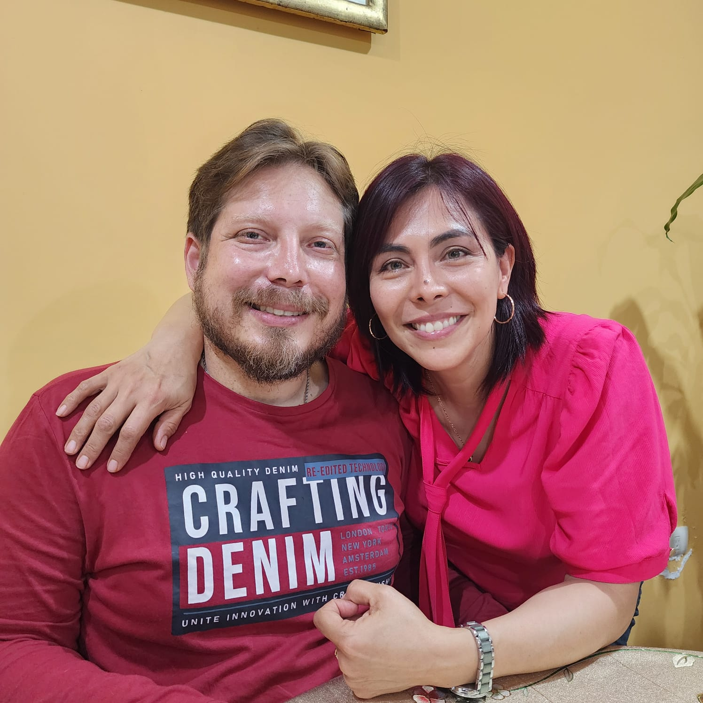
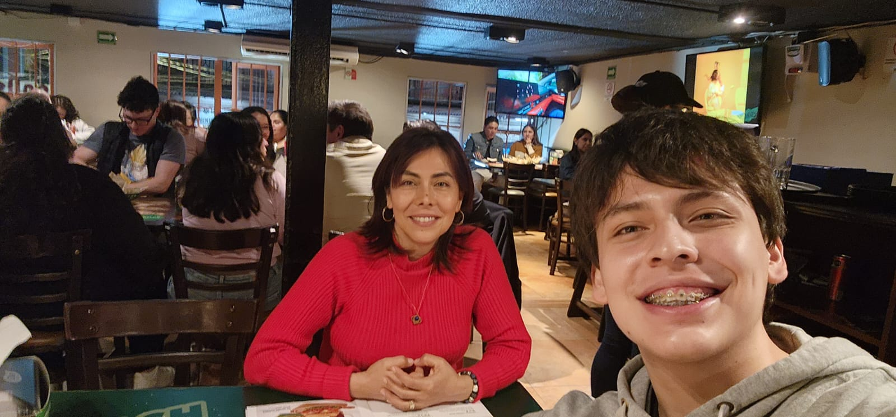
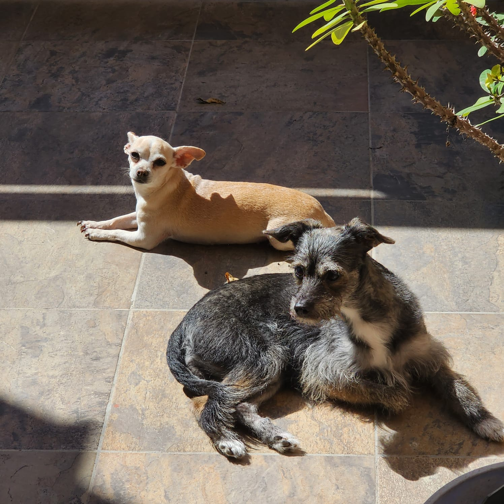

# 👋 ¡Hola! Soy Carlos Alberto Vázquez Peraza

> “Hubo una vez que no chambié por 8 meses; gracias a Dios, al noveno mes nací.” ✨

---

## 🪪 Sobre mí
- 👤 Nombre: Carlos Alberto Vázquez Peraza
- 🎂 Edad: 17
- 🌎 De: Xalapa, Veracruz, México — nacido en Córdoba, Veracruz
- 🗣️ Idiomas: Español • Inglés • Francés (intermedio)
- 🎓 Estudiante de: Mecatrónica y Música
- 🔧 Tecnologías que manejo: Python • C • C++ • Rust

---

## 💫 Lo que me gusta
- 🎵 Música: Electro swing
- 🎬 Películas: Interestelar • Nobody
- 📚 Lectura: Terror • Autoayuda/Desarrollo personal
- 🍽️ Comidas favoritas: Quecas • Huevo con frijol
- 🎮 Hobbies: Videojuegos • Estudiar programación • Aprender nuevas habilidades

---

## 🌱 Lo que hago y me mueve
- 🎯 Metas personales: Aprender y construir proyectos propios, viajar a Europa (especialmente Alemania), crecer en mecatrónica y música
- 💡 Intereses: Tecnología, diseño de sistemas, creatividad musical, aprendizaje continuo
- 🤝 Me encanta conectar con: Personas curiosas, makers y amantes de la ciencia/arte
- 🧘 Bienestar: Constancia, familia y proyectos que me reten

---

## 📸 Un poco de mi mundo

> Momentos que me definen

Mis papás

---

Mi mamá y yo

---

Yoko y Duquesita (falta Kiki)

---

## 🗺️ De dónde vengo
- 🏠 Nací en: Córdoba, Veracruz
- 🧳 Historia breve: He tenido una vida increíble con altos y bajos; cada experiencia valió la pena para ser quien soy hoy.
- 👨‍👩‍👧‍👧 Familia: Dos hermanas y tres perritas
- 🤲 Valores: Curiosidad • Perseverancia • Gratitud

---

## 🧩 Cosas random sobre mí
- 🎲 Me encanta jugar juegos de mesa
- 🕵️‍♂️ Disfruto ver videos de misterio
- 🔩 Me gusta armar y construir cosas
- 🎥 Ver pelis con mi mamá es de mis planes favoritos

---

## ✈️ Viajes y sueños
- 🌍 Aún no he viajado, pero me encantaría ir a Alemania

---

## 🧠 Ahora mismo
- 📖 Estudiando: Mecatrónica y teoría musical
- 🧪 Practicando: Proyectos en Python, C/C++ y Rust
- 🎧 Escuchando: Electro swing y playlists para concentrarme
- 📈 Aprendiendo: Nuevas habilidades técnicas y creativas

---

## 🛒 Ventas y mayoreo
> Productos y licencias que ofrezco. Escríbeme para precios actualizados, promociones por volumen y métodos de pago.

| Producto/Servicio | Duración/Presentación | Modalidad | Notas |
| --- | --- | --- | --- |
| Licencia ChatGPT | 2 meses | Digital | Activación remota |
| Licencia ChatGPT | 3 meses | Digital | Soporte básico |
| Licencia ChatGPT | 1 año | Digital | Renovación opcional |
| Licencia Perplexity | 2 meses | Digital | Acceso premium |
| Licencia Perplexity | 3 meses | Digital | Consulta guiada |
| Licencia Perplexity | 1 año | Digital | Mejor precio por año |
| Spotify Premium | 1 año | Digital | Cuenta nueva o existente |
| AIProd | 1 año (o plan acordado) | Digital | Confirmar plan disponible |
| MagSafe (accesorios) | Mayoreo (packs) | Físico | Descuentos por volumen |

> Puedo generar paquetes combinados (por ejemplo, ChatGPT + Spotify + Perplexity) a precio especial por mayoreo. Entrega inmediata en productos digitales.

---

## 📬 Contacto y redes
- 📧 Email: mrcavp@gmail.com
- 📱 WhatsApp: 228 496 3952
- 📸 Instagram: @mr_logros

---

## 📌 Nota para clientes
> Para licencias digitales: una vez confirmado el pago, la activación se realiza en minutos. Recomendable compartir el correo correcto y, si aplica, el usuario de la plataforma para evitar retrasos. Para MagSafe y accesorios físicos, manejo envíos a acordar; pregunta por disponibilidad y tiempos. Los precios pueden variar por tipo de cambio y promociones vigentes. Para mayoreo, solicita cotización con la cantidad exacta y destino.

---

## 🧰 Habilidades

### Lenguajes de programación
- Python • C • C++ • Rust

### Áreas de fortaleza
- Matemáticas • Física • Tecnología • Programación

<!-- Badges tipo “cuadritos” -->

  
  
  
  

  
  
  
  

## 🧭 Plantilla express para tu foto
Arrastra tu foto al editor de GitHub o súbela a /assets y usa:

